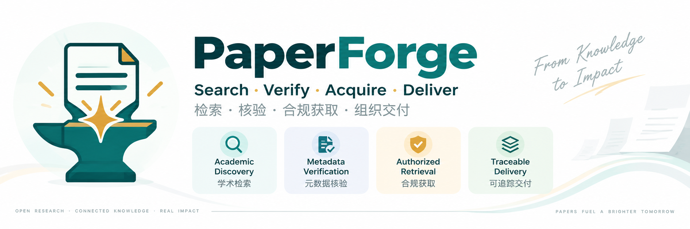
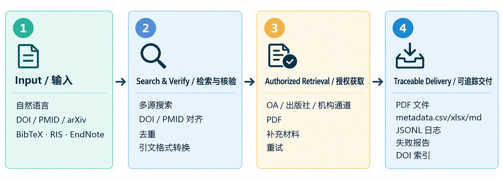
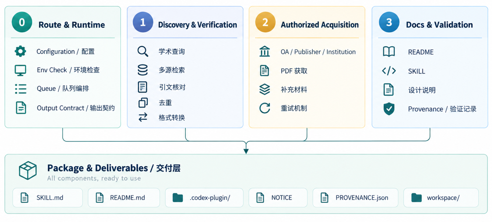
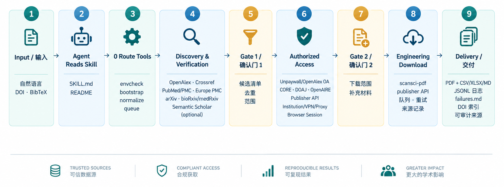

<p align="center"></p>
<h1 align="center">PaperForge</h1>
<p align="center"><strong>Find it. Fetch it. Organize it.</strong></p>

PaperForge 是一个面向 Codex、Claude Code、OpenCode、DSH 等 coding agent 的文献获取技能：把自然语言检索需求、DOI 清单或 BibTeX/RIS/EndNote 引文，变成可追踪的 PDF、元信息表和失败报告。

## 能做什么



PaperForge 将检索、引文核对、去重、授权获取、补充材料处理、来源记录和结构化交付串成一个可审计流程。

## 输入与输出

支持自然语言检索需求、DOI/PMID/arXiv 清单、BibTeX/RIS/EndNote 引文，以及全文或补充材料要求。

```text
workspace/
├── pdfs/<doi>.pdf
├── metadata.csv / metadata.xlsx / metadata.md
├── logs/run-<timestamp>.jsonl / .md
├── failures.md
└── doi_index.json
```

## 给 Codex 的安装提示词

```text
请先阅读 PaperForge 的 README.md 和 SKILL.md。
先运行环境检查并生成配置计划，不要直接修改配置。
涉及 API key、机构账号、cookie 或网页登录时等我操作。
只有我确认计划后，才执行 apply。
```

## 快速开始

```powershell
powershell -NoProfile -ExecutionPolicy Bypass -File 0路由\scripts\install.ps1
python 0路由\scripts\envcheck.py
python 0路由\scripts\bootstrap.py check
```

先运行 `bootstrap.py plan` 展示计划，获得确认后再运行 `bootstrap.py apply`。

## 使用示例

```text
找 2020 年以来关于钙钛矿稳定性的 20 篇高被引论文，先给候选列表，不要下载。
```

```text
把这个 DOI 清单下载成 PDF，并生成带标题、作者、期刊、年份、DOI、文件名和失败原因的 metadata.csv。
```

```text
把 references.bib 中的论文下载下来，优先使用开放获取和我的机构权限，并记录每篇的下载来源。
```

## 目录结构



| 目录 | 用途 |
|---|---|
| `0路由/` | 路由、队列、下载编排、部署检查和输出契约 |
| `1学术查询/` | 多源检索、引文核对、去重和引用格式转换 |
| `2工程化下载/` | 授权来源、机构通道和补充材料下载 |
| `docs/` | 设计与验证说明 |
| `SKILL.md` | Agent 主技能说明 |
| `.codex-plugin/` | Codex 插件元数据 |

## PaperForge 工作流



检索侧可组合 OpenAlex、Crossref、PubMed/PMC、Europe PMC、arXiv、bioRxiv/medRxiv，以及可选的 Semantic Scholar；获取侧优先走 Unpaywall/OpenAlex OA、CORE、DOAJ、OpenAIRE、出版社页面或 ScienceDirect/Elsevier API、机构 WebVPN/EZproxy 和用户授权的浏览器会话。`0路由` 负责环境检查、计划、队列和输出契约，`1学术查询` 负责检索与规范化，`2工程化下载` 负责授权下载、补充材料、重试和来源记录，最终生成 PDF、CSV/XLSX/Markdown、JSONL 日志、失败报告和 DOI 索引。

## 合规与隐私

PaperForge 不授予任何内容访问权。使用者必须遵守所在司法辖区、机构订阅许可、出版社条款和版权法规。默认配置优先使用开放获取、出版社 API 和用户有权访问的机构通道。

## 来源与许可证

PaperForge 的原创路由与部署代码使用 Apache-2.0。部分检索和下载能力基于本地化的上游项目，归属和改动记录见 [`NOTICE`](NOTICE) 与 [`PROVENANCE.json`](PROVENANCE.json)。
